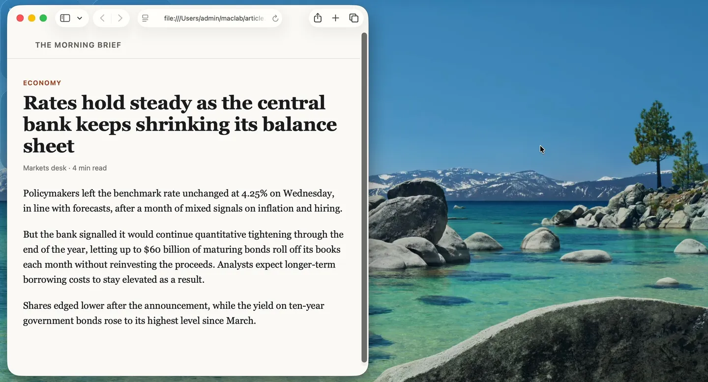
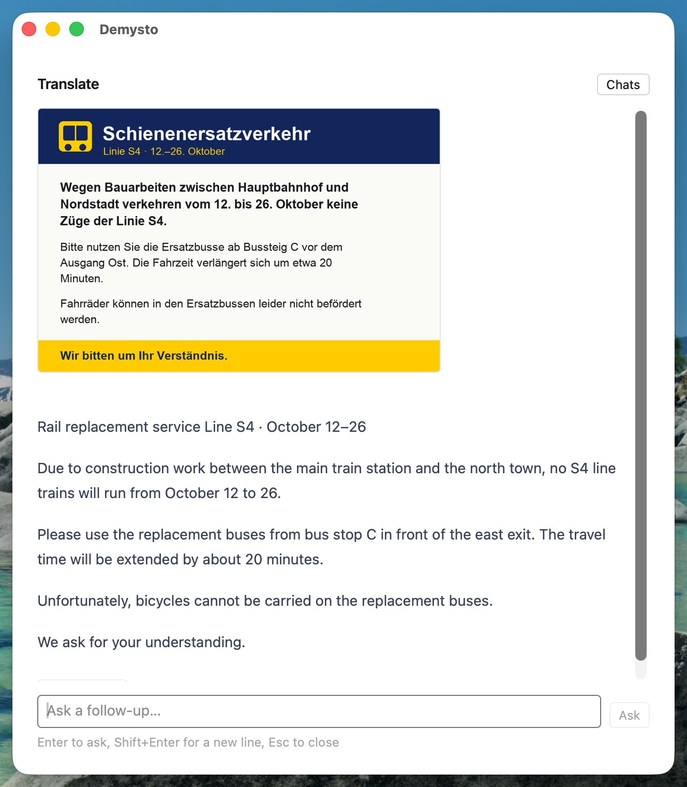

# Demysto

**Select anything. Press a key. Understand it.**

Explain, translate and summarize whatever you are looking at, without leaving it.

[**Download**](https://github.com/sanail/demysto/releases/latest) · macOS · Windows · Linux

## Why

You run into a term you don't know, a paragraph that assumes context you lack, or
a page in a language you don't read. Getting an answer means switching to a chat
window, pasting, writing a prompt around the paste, and switching back. Most of
the time that isn't worth it, so you don't ask.

Demysto skips the detour. Select the text, press the Hotkey and pick an Action.
The answer appears next to what you were reading, and it already knows what you
asked about.

## What it does

- **Explain, Translate, Summarize.** Built in and one keypress away, in any
  application.
- **Works on pictures too.** Copy a screenshot, a diagram or a photo of a sign
  and ask about it the same way.

  

    
  

- **Keep asking.** Every answer is a chat about your selection, so a follow-up is
  one line of typing, with nothing to paste again.
- **Custom… for one-off questions.** Type the instruction when none of the
  Actions fits.
- **Your own Actions.** A name and a prompt make a new Action. Give the ones you
  use most a Hotkey of their own and skip the list of Actions entirely.

  

    
  

## Why Demysto

- **Any Model you like.** OpenAI, DeepSeek, OpenRouter or any other
  OpenAI-compatible service, or a local Model through Ollama or LM Studio. You
  use your own key and pay the Provider directly, with no subscription in
  between.
- **Private by design.** No account and no telemetry. Chats are kept in memory
  and are gone when you quit, and the log records what happened, never what you
  read. With a local Model, your text never leaves your computer.
- **Out of your way.** Demysto waits in the tray and opens at your cursor. It
  works from the keyboard alone, and with the mouse just as well.
- **At home on every desktop.** macOS, Windows, and Linux on both X11 and
  Wayland.
- **Free and open source,** under the MIT License.

## Get started

Download the installer for your system from the
[latest release](https://github.com/sanail/demysto/releases/latest) and run it. A
short first-run guide connects your Provider and shows you the Hotkey.

[Getting started](docs/getting-started.md) covers installation on each system,
choosing a Provider, working with pictures, and writing your own Actions.

---

  <a href="CHANGELOG.md">Changelog</a> · <a href="LICENSE">MIT License</a>

