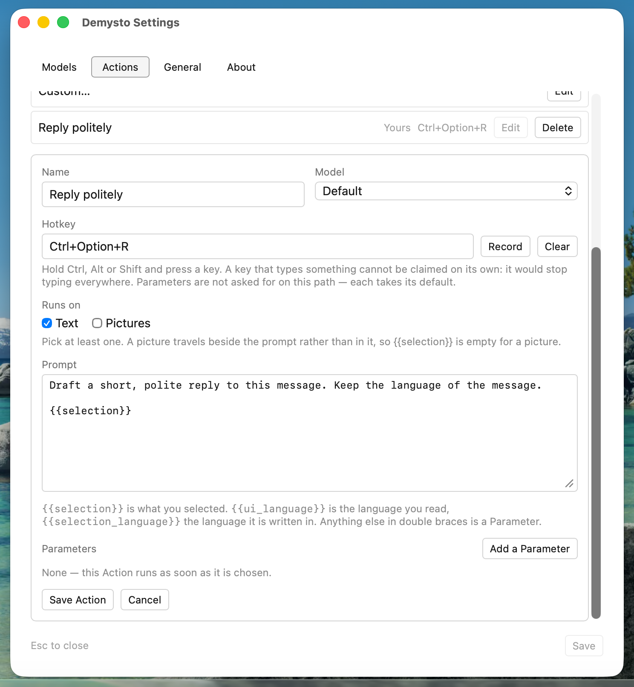

# Getting started with Demysto

This guide covers installing Demysto, connecting a Model, and making Demysto
your own. Everything here is done in Demysto's own windows, and you never need
to edit a file by hand.

- [Install](#install)
- [The first run](#the-first-run)
- [Choosing a Provider](#choosing-a-provider)
- [Everyday use](#everyday-use)
- [Pictures](#pictures)
- [Your own Actions](#your-own-actions)
- [Linux on Wayland](#linux-on-wayland)
- [Updates](#updates)
- [Where Demysto keeps its settings](#where-demysto-keeps-its-settings)
- [Uninstall](#uninstall)

## Install

Download the file for your system from the
[latest release](https://github.com/sanail/demysto/releases/latest).

Demysto's builds are not yet signed with an Apple or Microsoft certificate, so
the first launch shows a warning. You only have to get past it once.

### macOS

1. Download `Demysto_<version>_universal.dmg`. It runs on both Apple silicon and
   Intel Macs.
2. Open it and drag **Demysto** into **Applications**.
3. Open Demysto. macOS says it cannot verify the developer. Close the message,
   open **System Settings → Privacy & Security**, scroll down, and click
   **Open Anyway** next to Demysto.

### Windows

1. Download `Demysto_<version>_x64-setup.exe`, or the `.msi` if you prefer
   Windows Installer.
2. Run it. If SmartScreen says "Windows protected your PC", click
   **More info**, then **Run anyway**.

### Linux

Pick whichever package suits your distribution:

| Package | Install |
|---|---|
| `.deb` (Debian, Ubuntu, Mint) | `sudo apt install ./Demysto_<version>_amd64.deb` |
| `.rpm` (Fedora, openSUSE) | `sudo dnf install ./Demysto-<version>-1.x86_64.rpm` |
| `.AppImage` (any distribution) | `chmod +x Demysto_<version>_amd64.AppImage`, then run it |

## The first run

When Demysto starts for the first time, a short guide walks you through the
setup:

1. **Language.** Demysto uses your system's language when it has a translation
   for it, and English otherwise. You can change it here or later in Settings.
2. **Provider.** Pick the service your answers come from, paste its key, and
   fetch the Models it offers. Choose a Default Model and verify the key. Demysto
   sends a real request, so a wrong key shows up now and not at your first
   question.
3. **Accessibility** (macOS only). macOS only lets Demysto read your selection
   once it has the Accessibility permission. Open **Privacy & Security →
   Accessibility** and turn Demysto on. You can skip this step, and Demysto will
   ask again when it needs the permission.
4. **Start at login.** Demysto only answers while it is running, so it is best
   started with your computer.
5. **Done.** The guide shows the Hotkey. Try it right away.

## Choosing a Provider

Demysto doesn't come with a Model of its own. It connects to a service you
choose, using your own account. You can add several Providers and switch between
their Models at any time in **Settings → Models**.

| Provider | What you need |
|---|---|
| **OpenAI** | An API key from platform.openai.com |
| **DeepSeek** | An API key from platform.deepseek.com |
| **OpenRouter** | An API key from openrouter.ai, which gives access to Models from many vendors |
| **Ollama** | Ollama running on your computer. No key needed. |
| **LM Studio** | LM Studio's local server running. No key needed. |
| **Any other OpenAI-compatible service** | Its base URL and a key |

**Local Models.** With Ollama or LM Studio, everything happens on your computer.
Nothing you select is sent anywhere, and nothing costs money per question.

**Keys in the environment.** If you'd rather not store a key in Demysto's
settings, set the variable the service's own documentation names:
`OPENAI_API_KEY`, `DEEPSEEK_API_KEY` or `OPENROUTER_API_KEY`. Demysto picks it
up at startup.

**Default Models.** An Action uses the **Default Model** unless it names one of
its own. Pictures go to the **Default Model for pictures**, since the cheap
everyday Model often can't see images. When you add a Model by hand, tick
**Sees images** if it accepts them.

## Everyday use

1. Select text in any application.
2. Press the Hotkey: <kbd>Cmd</kbd>+<kbd>Shift</kbd>+<kbd>Space</kbd> on macOS,
   <kbd>Ctrl</kbd>+<kbd>Shift</kbd>+<kbd>Space</kbd> on Windows and Linux.
3. The list of Actions opens at your cursor. Press <kbd>Enter</kbd> to run the
   highlighted one, use the arrow keys or type a few letters to pick another,
   or press <kbd>Esc</kbd> to close the list.
4. The answer streams into a chat window. Type a follow-up question underneath
   and press <kbd>Enter</kbd>. The chat already has your selection, so there's
   nothing to paste.

If nothing is selected, Demysto uses what's on the clipboard instead.

Some Actions ask a question before they run. **Translate**, for example, asks
which language to translate into. **Custom…** asks what you want done, which
makes it handy for one-off requests that no Action covers.

**Chats** in the chat window lists your recent conversations. They are kept only
until you quit Demysto.

You can change the Hotkey in **Settings → General**.

## Pictures

Copy a picture, such as a screenshot, a diagram, an error dialog or a photo of a
sign, and press the Hotkey. The list of Actions shows a thumbnail of what it
found, and offers the Actions that work on pictures: **Describe image**,
**Translate** and **Custom…** out of the box.

For this you need a Model that can see images, set as the **Default Model for
pictures** in **Settings → Models**. If none is set, the chat tells you and
links straight to the setting.

Large pictures are scaled down before they are sent, which is faster and
cheaper. When a picture was scaled down, the chat offers to ask again at full
resolution in case the answer missed a detail.

## Your own Actions

Open **Settings → Actions** and click **New Action**.

  

An Action is:

- **Name.** How it appears in the list of Actions.
- **Prompt.** What the Model is told. Use `{{selection}}` where your selection
  goes. `{{ui_language}}` is the language you read, and `{{selection_language}}`
  is the language the selection is written in.
- **Runs on.** Text, pictures, or both.
- **Model.** Leave it on **Default**, or pick a specific Model for this Action.
- **Hotkey.** Optional. An Action with its own Hotkey runs immediately and
  skips the list.
- **Parameters.** Optional. Write another `{{name}}` in the prompt and add it
  under **Parameters** with a question, and Demysto asks it before running,
  the way **Translate** asks for the target language.

The built-in Actions can be edited the same way. **Reset** brings back the
original.

Each Action is saved as a file of its own, so you can back one up or share it
with somebody.

## Linux on Wayland

Wayland doesn't let one application read another's selection, so on Wayland
Demysto works with the clipboard: copy the text with <kbd>Ctrl</kbd>+<kbd>C</kbd>
first, then press the Hotkey.

Hotkeys on Wayland are managed by the desktop itself. Change them in your
desktop's keyboard settings, where they are listed under Demysto.

On X11, Demysto reads the selection directly, as on macOS and Windows.

## Updates

Demysto checks for a new version at startup and once a day after that. When
one is available, it appears in the tray menu and in **Settings → About**.
Nothing is installed until you click **Install and restart**. Every update is
signed and verified before it is applied.

On macOS, the Accessibility permission has to be granted again after each
update, because macOS treats an unsigned update as a new application.

## Where Demysto keeps its settings

**Settings → About** shows the folder. By default it is:

| System | Folder |
|---|---|
| macOS | `~/Library/Application Support/demysto` |
| Windows | `%APPDATA%\demysto` |
| Linux | `~/.config/demysto` |

The folder holds your settings, your Actions and the log. The log records what
Demysto did, such as which Action ran, which Model answered and what went wrong,
but never what you selected or what the Model said. Attach it when you report a
bug.

## Uninstall

- **macOS:** quit Demysto from the menu bar and move it from **Applications**
  to the Trash.
- **Windows:** remove Demysto in **Settings → Apps → Installed apps**.
- **Linux:** remove the Demysto package with your package manager, or delete
  the AppImage.

To remove your settings and Actions too, delete the folder listed above.
